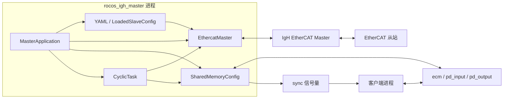
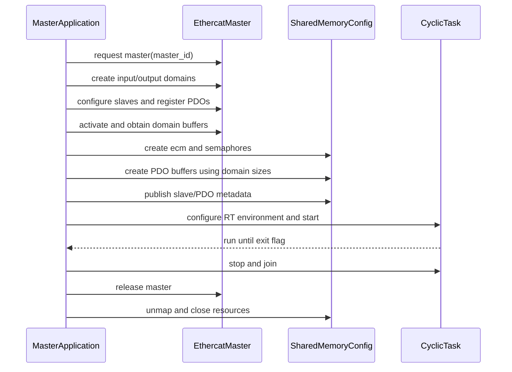

# ROCOS IgH 主站架构设计

## 1. 目标

本项目实现一个基于 IgH EtherCAT Master 的最小可用 C++ 主站，满足以下要求：

- 周期收发 PDO，目标最短周期为 1 ms。
- 将从站输入发布到 POSIX 共享内存，并从共享内存取得从站输出。
- 使用命名信号量通知客户端新一周期的数据已就绪。
- 支持多个 IgH 主站，且不同主站的 EtherCAT、共享内存和信号量完全隔离。
- 使用 CMake 构建，硬件无关测试默认可运行。

1 ms 是设计目标，不是普通 Linux 环境下的确定性保证。实际周期能力取决于 IgH 驱动、PREEMPT_RT、CPU 隔离、内存锁定、线程优先级和硬件拓扑。

## 2. 设计原则

- **单一职责**：EtherCAT 生命周期、周期调度、YAML 配置解析、IgH 配置转换和 IPC 各自独立。
- **每主站一个进程**：一个进程只请求一个 `master_id`，多主站通过启动多个进程实现。
- **启动时配置**：使用 YAML 描述从站和 PDO，启动阶段一次性解析并转换为稳定的 IgH 指针视图。
- **实时路径最小化**：激活前完成配置、分配和映射；周期线程不分配内存、不阻塞、不输出日志。
- **保持 IPC 兼容**：复用 [shared_memory_config.hpp](../src/shared_memory_config.hpp) 的数据结构、接口和旧类型别名。

## 3. 总体架构



系统只包含一个主站可执行程序和一个供其复用的核心库，不增加守护服务、插件系统或进程间消息总线。

## 4. 组件职责

### 4.1 `MasterApplication`

进程入口和对象所有者：

- 解析必选配置路径、`master_id` 和周期参数，周期默认 `1000 us`，不得小于 `1000 us`。
- 安装退出信号处理；信号处理函数只修改 `sig_atomic_t` 退出标志。
- 按固定顺序初始化 EtherCAT、IPC 和实时线程。
- 在退出时先停止周期线程，再释放 EtherCAT 和 IPC 资源。

它不处理 PDO 内容，也不包含从站型号相关逻辑。

### 4.2 PDO 配置

`PdoBusConfig` 是硬件无关的 YAML 数据模型，`LoadedSlaveConfig` 持有转换后的
IgH 数组并暴露 `StaticSlaveConfig` 指针视图：

- YAML 中的从站 ID 决定总线位置，alias 固定为 0。
- 每个从站分别配置 RxPDO、TxPDO 和 PDO Entry 映射。
- 每个 PDO Entry 的方向、索引、子索引、位宽和共享内存名称。

启动时使用 yaml-cpp 解析配置，固定生成 RxPDO/SM2 和 TxPDO/SM3。PDO 注册期间
IgH 会写入条目偏移，vendor ID 和 product code 从扫描到的 SII 信息读取并写回。
所有动态存储在进入周期循环前完成，周期调度逻辑不读取 YAML。

### 4.3 `EthercatMaster`

封装一个 IgH 主站的完整生命周期：

- 请求 `master_id` 对应的 IgH master。
- 创建输入 domain 和输出 domain。
- 根据 `StaticSlaveConfig` 创建从站配置、配置 PDO 并注册 PDO Entry。
- 激活主站，缓存两个 domain 的数据指针和长度。
- 提供无分配的周期操作和状态快照。
- 停机时释放 master。

输入和输出使用两个 domain，目的是让两个方向各自形成连续缓冲区，周期内可直接执行定长 `memcpy`，避免维护逐变量复制逻辑。

### 4.4 `CyclicTask`

唯一实时线程，负责绝对时间周期调度和 PDO 交换。它只依赖已初始化的 `EthercatMaster` 和 `SharedMemoryConfig`。

启动前完成：

- 锁定当前及未来内存页。
- 设置实时调度策略和优先级。
- 预触碰周期线程所需内存，避免首访问缺页。
- 计算绝对时间的首个唤醒点。

### 4.5 `SharedMemoryConfig`

直接复用现有接口：

- 主站侧通过 `SharedMemoryConfig(master_id)` 创建 IPC。
- 客户端通过 `SharedMemoryConfig::getInstance(master_id)` 连接 IPC。
- `EcatBus` 保存状态、周期统计、从站和 PDO 元数据。
- `pd_input{id}` 保存从站到主站的数据。
- `pd_output{id}` 保存客户端要求主站发送给从站的数据。
- `sync{id}_{0..9}` 通知等待客户端输入数据已更新。

`EcatBus`、`Slave` 和 `PdVar` 是跨进程 ABI，首版不改变其字段布局。

## 5. 多主站模型

每个主站运行一个独立进程：

```text
rocos_igh_master --config config/master0.yaml --master-id 0 --period-us 1000
rocos_igh_master --config config/master1.yaml --master-id 1 --period-us 1000
```

资源映射如下：

| `master_id` | IgH master | 总线状态 | PDO 输入 | PDO 输出 | 信号量 |
|---:|---:|---|---|---|---|
| 0 | 0 | `ecm0` | `pd_input0` | `pd_output0` | `sync0_0` ... `sync0_9` |
| 1 | 1 | `ecm1` | `pd_input1` | `pd_output1` | `sync1_0` ... `sync1_9` |

表中是逻辑名称；POSIX API 使用的实际名称由 `SharedMemoryConfig` 补充前导 `/`。进程之间不共享可变的 C++ 全局状态。任一主站退出或故障不得停止其他主站。

## 6. 初始化与退出



任一步初始化失败都立即停止启动，按已完成步骤的逆序清理，不创建周期线程。IgH 配置阶段与运行阶段的 API 约束见 [api-guide.md](api-guide.md)。

## 7. 周期数据流

每个周期严格执行：

```text
clock_nanosleep(TIMER_ABSTIME)
ecrt_master_receive
ecrt_domain_process(input_domain)
ecrt_domain_process(output_domain)
memcpy(pd_input, input_domain_data, input_domain_size)
memcpy(output_domain_data, pd_output, output_domain_size)
update EcatBus state and timing counters
ecrt_domain_queue(input_domain)
ecrt_domain_queue(output_domain)
ecrt_master_send
notify waiting clients
```

PDO 方向以主站视角定义：

- **输入**：从站 TxPDO，经输入 domain 复制到 `pd_input{id}`。
- **输出**：客户端写入 `pd_output{id}`，再复制到输出 domain，作为从站 RxPDO 发送。

客户端被唤醒时，本周期输入快照已完整写入。客户端随后写入的输出最早在下一周期被主站取走。该一周期延迟换取简单、确定的数据边界，不在首版增加双缓冲或序列锁。

首版规定每个 `master_id` 只能有一个输出写客户端。由于现有 `pd_output` 没有提交序号、互斥协议或双缓冲，主站复制期间客户端写入多个 PDO 时可能得到新旧值混合的输出快照；相关 PDO 必须作为一致事务更新的场景不属于首版能力。

周期使用绝对时间休眠以避免累计漂移。若线程错过一个或多个截止时间，记录超时并把下一截止时间推进到未来最近周期，不连续补跑历史周期。

## 8. 状态与故障行为

### 8.1 初始化故障

以下情况视为致命错误并退出：

- 请求主站、创建 domain、配置从站、注册 PDO 或激活失败。
- 创建或映射共享内存失败。
- 无法满足实时调度或内存锁定要求。
- PDO domain 大小超过共享内存上限。

初始化阶段允许输出一次明确错误信息；周期线程启动后禁止逐周期打印。

### 8.2 运行期异常

- **WKC 异常或从站掉线**：继续执行收发周期，更新 `EcatBus` 状态和异常计数，不在周期线程中重配从站。
- **周期超时**：更新当前、最小、最大和平均周期时间，并累计超时次数；继续下一个未来截止时间。
- **客户端未更新输出**：继续发送 `pd_output{id}` 中最近可见的值；首版不检测输出新鲜度。
- **客户端处理过慢**：信号量只表示“至少有新数据”，不排队保存每个历史周期。
- **主站链路恢复**：由 IgH 状态机继续处理；首版不实现应用层自动重建配置。

现有 `EcatBus` 没有异常计数字段。首版实现时周期超时和 WKC 计数保留在进程内部，通过限频的非实时状态报告输出；只有进行 ABI 版本设计后才能向共享结构增加字段。

## 9. 实时约束

周期线程中允许：

- IgH 标记为 `master_op, rt_safe` 的 API。
- 对预先映射的固定长度缓冲区执行 `memcpy`。
- 简单整数或浮点统计、原子/信号安全标志读取和非阻塞信号量通知。

周期线程中禁止：

- 动态内存分配、容器扩容和字符串构造。
- 文件、终端、网络日志等阻塞式 I/O。
- `sleep_for` 等相对时间循环。
- SDO 写入、从站重扫、PDO 重配或共享内存重建。
- 获取可能被非实时线程长期持有的互斥锁。

硬件部署和诊断命令及其安全注意事项见 [ethercat-terminal-commands.md](ethercat-terminal-commands.md)。

## 10. 代码布局

当前实现的实际布局：

```text
src/
  main.cpp                    # 参数、信号、实时设置、初始化与退出顺序
  ethercat_master.hpp/.cpp    # IgH 生命周期与周期 API
  cyclic_task.hpp/.cpp        # 绝对时间实时循环与统计
  pdo_config.hpp/.cpp         # YAML PDO 数据模型、解析与校验
  slave_config.hpp/.cpp       # IgH 配置转换、格式化输出与元数据发布
  runtime_options.hpp/.cpp    # 严格命令行解析（无 EtherCAT 副作用）
  shared_memory_config.hpp    # IPC 与跨进程共享 ABI
tests/
  pdo_config_test.cpp             # YAML 解析和格式校验
  shared_memory_config_test.cpp  # IPC、IgH 配置视图和周期逻辑测试
CMakeLists.txt
cmake/
  FindEtherCAT.cmake
```

不为这些组件增加抽象基类。测试需要替代硬件时，只在 `EthercatMaster` 的窄接口处提供简单 fake（`EthercatMasterTestPeer`），不建立通用插件框架。

## 11. CMake 目标

构建目标由 `ROCOS_IGH_BUILD_MASTER` 选项切换两种模式：

| 目标 | 类型 | 用途 |
|---|---|---|
| `rocos_igh_core` | 静态库 / 接口库 | EtherCAT、周期任务和 IPC 实现（主站模式静态库，无硬件模式接口库） |
| `rocos_igh_master` | 可执行程序 | 链接核心库并提供进程入口（仅主站模式） |
| `pdo_config_test` | CTest 测试 | YAML 配置解析和校验 |
| `shared_memory_config_test` | CTest 测试 | 无硬件 IPC 行为验证 |

项目要求 C++17。CMake 必须查找 yaml-cpp、`ecrt.h`、`ethercat`、Threads 和 POSIX realtime 依赖，不硬编码安装路径。标准命令为：

```bash
# 无硬件模式（无需 IgH 开发文件）
cmake -S . -B build -DROCOS_IGH_BUILD_MASTER=OFF
cmake --build build
ctest --test-dir build --output-on-failure

# 主站模式（需要 ecrt.h 与 libethercat）
cmake -S . -B build-master -DROCOS_IGH_BUILD_MASTER=ON
cmake --build build-master
ctest --test-dir build-master --output-on-failure
```

## 12. 验证策略

### 12.1 默认无硬件测试

- 每个测试使用唯一 `master_id`，避免并行运行时名称冲突。
- 验证 `ecm{id}`、输入/输出共享内存和信号量名称隔离。
- 验证定长 PDO 输入发布和输出读取。
- 验证等待线程收到通知，并覆盖 `EC_SEM_NUM` 上限和重复等待。
- 验证正常退出后的映射、文件描述符和信号量清理。
- 验证 `EcatBus`、`Slave`、`PdVar` 的关键 `sizeof` 与字段偏移，防止 ABI 意外变化。

### 12.2 硬件集成测试

硬件测试默认不由 CTest 运行，显式启用后验证：

- INIT/PREOP/SAFEOP/OP 状态转换。
- 输入/输出 PDO 与真实从站一致。
- WKC 异常和链路断开时的状态行为。
- 1 ms 条件下的周期统计和长时间运行稳定性。
- 同时运行 master 0 和 master 1 时的数据与故障隔离。

## 13. 当前范围

当前实现：

- 单进程单主站、多进程多主站。
- 启动时 YAML 从站和 PDO 配置。
- 两个 domain 的周期 PDO 收发。
- 现有共享内存与信号量接口。
- 最小周期统计、状态更新和有序退出。
- CMake 构建及无硬件 IPC 测试。

当前不实现：

- 配置热加载。
- SDO/SoE/FoE 管理接口。
- Web、GUI、RPC 或数据库。
- 主站间同步或统一管理进程。
- PDO 双缓冲、历史队列或每客户端独立数据副本。
- 应用层自动重扫和热插拔重配置。
- Distributed Clocks 高级同步策略；待基本 1 ms 周期稳定后单独设计。

## 14. 实现顺序

> 截至当前，步骤 1–5 已完成；步骤 6（真实从站 + 实时内核下的 1 ms 验证）待硬件环境就绪后执行。

1. 建立 CMake、IgH 查找模块和最小可执行目标。
2. 实现静态从站配置和 `EthercatMaster` 初始化/释放。
3. 补齐并验证 `SharedMemoryConfig` 的无硬件测试与资源清理。
4. 实现单主站周期线程和两个 domain 的复制路径。
5. 验证 `master_id` 隔离并同时运行两个主站进程。
6. 在具备实时内核和真实从站的环境中验证 1 ms 周期。